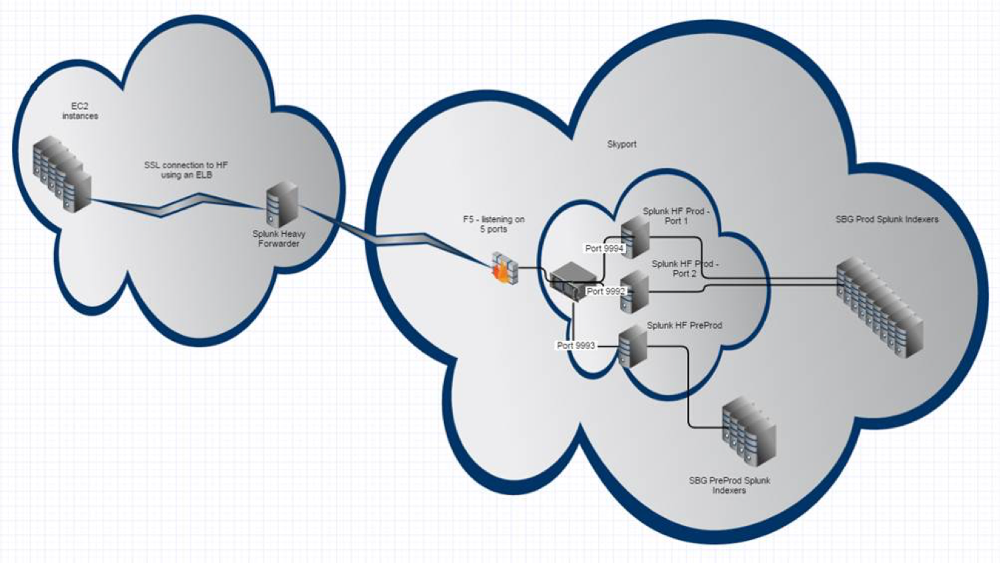

#SBG Use Case

##Use Case #1: log forwarding AWS-IHP

SBG has application components running in both IHP and AWS . Splunk is our primary tool for gaining real-time understanding of what’s happening across our IT and technology infrastructure . Due to the interdependecy of some of the application components in both locations (AWS & IHP), SBG requires logs from multiple AWS accounts to be shipped to IHP Splunk cluster in order to generate a meaningful and to be able to correlate across different offerings/services within each eco-system. The available "paths" to shipping logs from AWS to IHP has been narrowed with VPN remediation . We need a viable solution (whitelisted by CST) to quickly meet our obligations to our customers . 

[Options considered](https://github.intuit.com/KAOS/patterns/tree/master/0005-Splunk/0005.1-AWS-Splunk-to-IHP-Splunk)

##Proposed Solution :

SBG will have multiple AWS Accounts (aka infrastructure accounts) which is isolated from other BU/FG/APP to limit exposure and blast radius .A splunk  Heavy Forwarders(HF) in the public subnet will forward logs over SSL to a dedicated Heavy Forwarder in IHP DMZ .The HF in DMZ will reside in a "secure enclave" managed by [Skyport appliance](https://wiki.intuit.com/display/SDT/SkyPort+Systems+POC) (a hardened compute appliance).  

The HF Will require a TCP ACL inbound to IHP. An appropriate ACLs are put in place to let the splunk data port through from the Heavy Forwarder in DMZ to the Splunk indexer in IHP. Additional protection is provided by skyport ;delivering a zero-trust, hardened computing environment as well as a set of security controls that are customized for Splunk workloads and  traffic pattern. 

###Pros:
* Ability to quickly troubleshoot operational issus or respond to seucrity events , as logs from both locations are correlated in one place 
* Remove dependency on VPN and provide an alternate secure path for sending data from AWS to IHP
* HF can be used to filter unwanted data before it gets to the indexers in IHP
* Insulate the indexing tier from direct access from the forwarder via the internet
* Skyport secure network perimeter for Splunk will protect splunk traffic against compromise while in transit. 
		

###Cons:
* Increased latency due to the multiple channels the logs will travel from AWS to Splunk instances in IHP		
* Additional ACLs to manage in ensuring communication between HF in AWS and HF in DMZ is secure.
